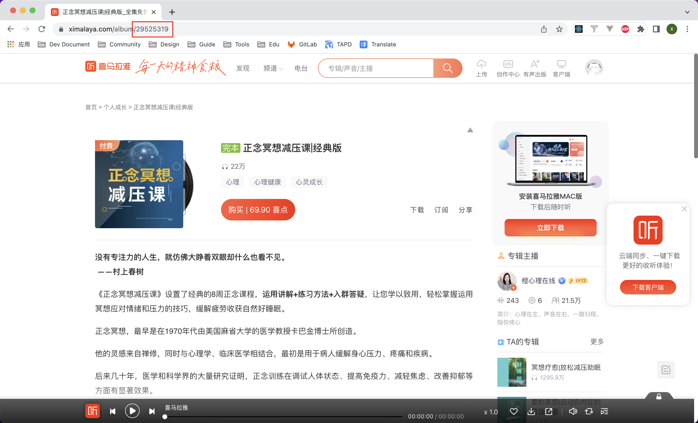

# xmly-download

> 因为不习惯使用喜马拉雅 APP，因为内容太杂乱、无法单曲循环等原因，所以想下载下来放到其他播放器里收听。

批量下载喜马拉雅专辑内所有音频文件

# 配置

配置`config.js`文件，填写`cookie`和`albumId`。

- `key` AES密钥，固定值无需修改
- `cookie` 通过控制台获取
- `albumId` 专辑id在url中获取，具体看下图
- `mediaType` 下载文件类型，支持以下4种
  - M4A_64 `[默认]`
  - M4A_24
  - MP3_64
  - MP3_32
- `output` 下载目录，默认为`./output`

专辑id获取方式：


# 开始

```bash
$ yarn

$ yarn start
```

or

```bash
$ npm install

$ npm run start
```